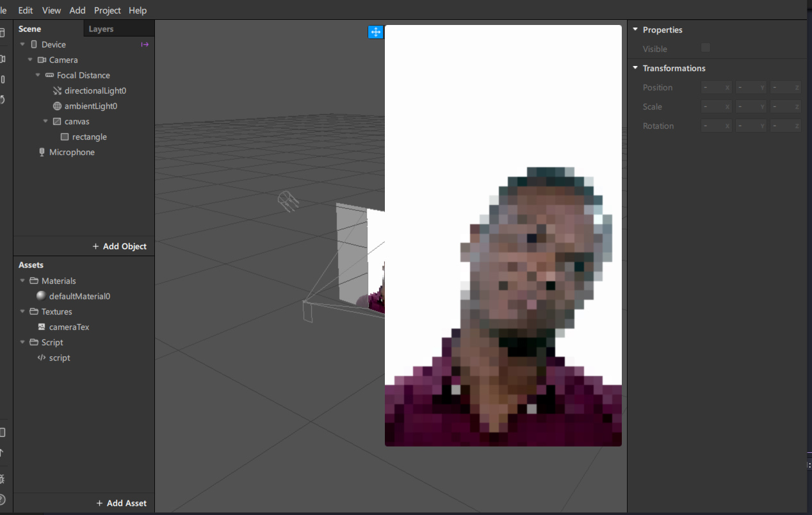

 

# sparkar-pixelate-shader
> simple script-only pixelate shader with Facebook SparkAR.

## setup

* install deps `npm i`
* webpack watching `npm run dev`
* webpack build `npm run build`

source: [script](./src/index.js)

## changes

* see [changelog](./CHANGELOG.md)

## credits

* thxx to [Kuno Hayato](https://github.com/kunofellasleep) 4 showing me the way with [this article](https://medium.com/birdman-inc/gaussian-blur-on-spark-ar-studio-833e171160d5).
